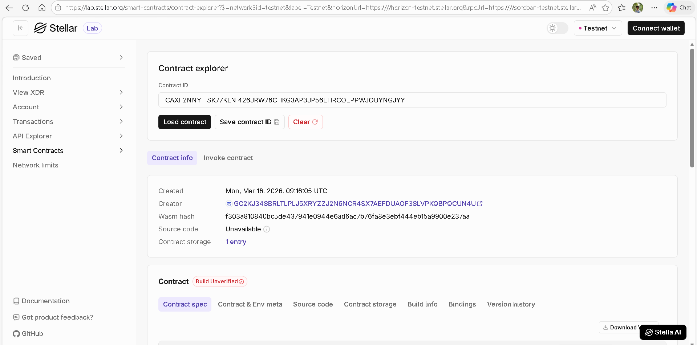

# 🎓 Student Record — Soroban Smart Contract

A production-ready smart contract built with **[Soroban](https://soroban.stellar.org/)** on the **Stellar** blockchain. It provides a tamper-proof, on-chain ledger for managing student enrolment, academic grades, and course assignments — all governed by a single admin address.

---

## 📖 Project Description

Educational institutions rely on centralised databases that are prone to tampering, data loss, and lack of transparency. **Student Record** moves the core registry onto the Stellar blockchain, making every enrolment event, grade submission, and course change permanently auditable by anyone — while keeping write access restricted to an authorised administrator.

The contract is written in **Rust**, compiled to **WebAssembly**, and deployed via the **Stellar CLI**. It follows Soroban's persistent-storage and access-control patterns and ships with a full unit-test suite.

---

## ✨ What It Does

| Action | Who can call | Description |
|---|---|---|
| `initialize` | Deployer (once) | Sets the admin address and seeds the ID counter |
| `enroll_student` | Admin | Creates a student record and returns a unique ID |
| `add_grade` | Admin | Appends a grade (0–100) to a student's record |
| `update_course` | Admin | Changes the course a student is enrolled in |
| `unenroll_student` | Admin | Soft-deletes a student (data preserved, status = false) |
| `get_student` | Anyone | Returns the full `Student` struct |
| `get_average_grade` | Anyone | Calculates the mean of all recorded grades |
| `is_enrolled` | Anyone | Returns a boolean enrolment status |
| `total_students` | Anyone | Returns the cumulative count of ever-enrolled students |

---

## 🚀 Features

- **On-chain immutability** — Every record is stored in Soroban persistent storage; no central party can silently alter data.
- **Role-based access control** — Only the admin address (set at deploy time) can write data; all read functions are public.
- **Auto-increment student IDs** — IDs are assigned automatically, preventing collisions with no off-chain coordination needed.
- **Grade history & averages** — Multiple grades are stored per student; the contract computes the average on demand.
- **Soft unenrolment** — Removing a student sets `enrolled = false` rather than deleting the record, preserving the audit trail.
- **Event emission** — `ENROLLED`, `UPDATED`, and `REMOVED` events are published on every state change for off-chain indexing.
- **Full test suite** — Unit tests cover enrolment, grading, averages, unenrolment, and student counts using `soroban-sdk`'s test utilities.
- **VS Code integration** — Pre-configured tasks for build, test, deploy, and lint — no terminal memorisation required.

---

## 🗂️ Project Structure

```
student_record/
├── src/
│   └── lib.rs              # Contract logic + unit tests
├── .vscode/
│   ├── extensions.json     # Recommended VS Code extensions
│   ├── settings.json       # Rust-analyzer & format-on-save config
│   └── tasks.json          # Build / Test / Deploy tasks
├── Cargo.toml              # Dependencies & release profile
├── rust-toolchain.toml     # Pins stable + wasm32 target
└── README.md
```

---

## 🛠️ Prerequisites

| Tool | Install |
|---|---|
| Rust (stable) | `curl https://sh.rustup.rs -sSf \| sh` |
| wasm32 target | `rustup target add wasm32-unknown-unknown` |
| Stellar CLI | `cargo install --locked stellar-cli --features opt` |

---


## ⚡ Quick Start

### 1 — Clone & open in VS Code

```bash
git clone <your-repo-url>
cd student_record
code .
```

Install the recommended extensions when prompted (**Rust Analyzer**, **Even Better TOML**, etc.).

### 2 — Build

Press `Ctrl+Shift+B` (or run **Tasks: Run Build Task** from the command palette) to compile the contract to WebAssembly.

```bash
stellar contract build
# Output: target/wasm32-unknown-unknown/release/student_record.wasm
```

### 3 — Run tests

Press `Ctrl+Shift+P` → **Tasks: Run Test Task**, or:

```bash
cargo test
```

### 4 — Deploy to Testnet

```bash
# Fund a test account
stellar keys generate --global default --network testnet --fund

# Deploy
stellar contract deploy \
  --wasm target/wasm32-unknown-unknown/release/student_record.wasm \
  --network testnet \
  --source default
# Prints: CONTRACT_ID
```

### 5 — Initialise the contract

```bash
stellar contract invoke \
  --id <CONTRACT_ID> \
  --network testnet \
  --source default \
  -- initialize \
  --admin <YOUR_STELLAR_ADDRESS>
```

### 6 — Enrol a student

```bash
stellar contract invoke \
  --id <CONTRACT_ID> \
  --network testnet \
  --source default \
  -- enroll_student \
  --caller <YOUR_STELLAR_ADDRESS> \
  --name "Alice" \
  --age 20 \
  --course "Computer Science"
# Returns: 1  (the new student ID)
```

### 7 — Add a grade

```bash
stellar contract invoke \
  --id <CONTRACT_ID> \
  --network testnet \
  --source default \
  -- add_grade \
  --caller <YOUR_STELLAR_ADDRESS> \
  --student_id 1 \
  --grade 88
```

### 8 — Query a student

```bash
stellar contract invoke \
  --id <CONTRACT_ID> \
  --network testnet \
  --source default \
  -- get_student \
  --student_id 1
```

---

## 🔑 Student Struct

```rust
pub struct Student {
    pub student_id: u64,
    pub name:       String,
    pub age:        u32,
    pub course:     String,
    pub grades:     Vec<u32>,  // 0–100 per subject
    pub enrolled:   bool,
}
```

---

## 🧪 Running Tests in VS Code

1. Open the **Command Palette** (`Ctrl+Shift+P`)
2. Select **Tasks: Run Test Task**
3. Watch the integrated terminal — all 4 tests should pass in green ✅

---

## 📜 License

MIT — feel free to use, fork, and extend.